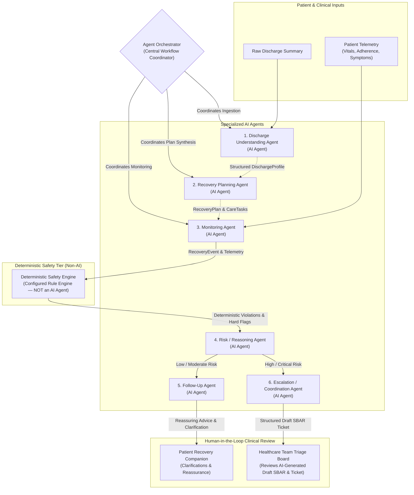
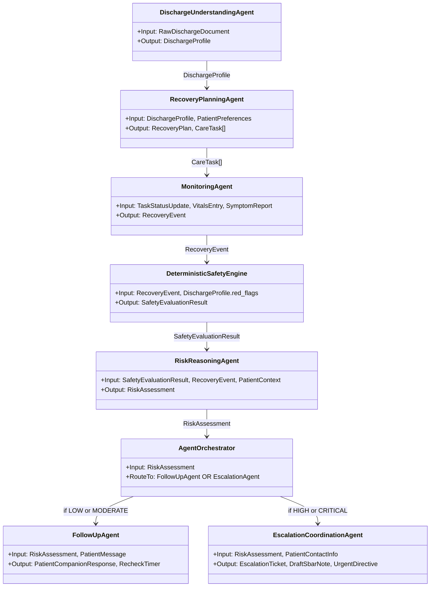

# CareBridge AI: Agent Specifications & Orchestration Design

> **Clinical Decision-Support Prototype Disclaimer:**
> CareBridge AI is an **Agentic AI healthcare decision-support and care-coordination prototype**. It is **NOT** an autonomous medical decision-maker and does **NOT** replace licensed healthcare professionals.

---

## 1. Safety Boundary & System Authority

### 1.1 What the AI Must NOT Do (Strict Clinical Prohibitions)
The AI system is strictly bounded by deterministic rules and prompt constraints. Under no circumstance shall the AI:
- ❌ **Diagnose diseases or medical conditions** (e.g., cannot state *"You have a surgical site infection"* or *"You are experiencing pulmonary embolism"*).
- ❌ **Prescribe medication** or recommend pharmacological treatments.
- ❌ **Change medication dosages** or alter intake timing without verified physician orders.
- ❌ **Change, add, or cancel treatment regimens**.
- ❌ **Make final clinical decisions** regarding patient care.
- ❌ **Replace healthcare professionals**, clinical triage teams, or emergency services.

### 1.2 What the System MAY Autonomously Perform (Authorized Workflow Actions)
The system is authorized to execute operational and administrative care-coordination workflows autonomously:
- ✅ **Create recovery tasks** and day-by-day recovery milestone checklists.
- ✅ **Track adherence** to prescribed medication and self-care schedules.
- ✅ **Record recovery events** and physiological vitals telemetry.
- ✅ **Evaluate deterministic safety rules** against configured clinical thresholds.
- ✅ **Create follow-up tasks** and automated check-in reminders for mild/moderate concerns.
- ✅ **Generate proactive alerts** on clinical dashboards for healthcare teams.
- ✅ **Generate draft SBAR notes** clearly marked as AI-generated drafts requiring clinical review.
- ✅ **Update recovery timelines** and progress milestones.
- ✅ **Prepare longitudinal recovery summaries** for outpatient clinical consultations.

---

## 2. System Components: Agents, Safety Engine & Orchestrator

The system cleanly separates **6 specialized AI agents** from non-AI deterministic and routing components:

1. **6 Specialized AI Agents:**
   - **Discharge Understanding Agent** (LLM-based document extraction and structuring)
   - **Recovery Planning Agent** (LLM-based milestone synthesis and task generation)
   - **Monitoring Agent** (Sensor, telemetry tracking, and missed-task identification)
   - **Risk/Reasoning Agent** (LLM-based contextual risk evaluation grounded by safety engine outputs)
   - **Follow-Up Agent** (LLM-based empathetic patient recovery companion and symptom clarification)
   - **Escalation/Coordination Agent** (LLM-based draft SBAR note and escalation ticket synthesis)

2. **Deterministic Safety Engine (NOT an AI Agent):**
   - A standalone, deterministic algorithmic evaluation component.
   - Evaluates explicit, configured clinical safety rules against raw patient inputs and vitals before or in parallel with any LLM invocation.
   - **Precedence Rule:** Deterministic safety rules **MUST take absolute precedence** over LLM reasoning. If a threshold is violated (e.g., patient temperature $101.8^\circ\text{F} \ge 101.5^\circ\text{F}$ threshold), the violation is locked, and no LLM reasoning can override or downgrade that result.

3. **Agent Orchestrator:**
   - The central system coordinator that manages the lifecycle, execution order, state machine transitions, and structured event routing between agents and system components.

---

## 3. End-to-End System Architecture & Data Flow



---

## 4. Agent Responsibility Matrix

| Component | Component Type | Core Responsibilities | What It CANNOT Do |
| :--- | :---: | :--- | :--- |
| **Discharge Understanding Agent** | AI Agent | Extracts diagnoses, procedures, medications, clock-time schedules, restrictions, and red-flag rules from raw discharge summaries into typed `DischargeProfile`. | Cannot invent or assume missing dosages; must flag ambiguities. |
| **Recovery Planning Agent** | AI Agent | Translates `DischargeProfile` into a 4-phase, 30-day recovery roadmap and atomic daily `CareTask` checklists. | Cannot prescribe new treatments or alter discharge medical orders. |
| **Monitoring Agent** | AI Agent | Continuously tracks task completion, calculates adherence scores, logs vitals, and detects missed critical tasks. | Cannot dismiss or ignore non-adherence patterns. |
| **Deterministic Safety Engine** | **Non-AI System Component** | Deterministically evaluates raw vitals and symptoms against hardcoded clinical thresholds (e.g., Temp $\ge 101.5^\circ\text{F}$, Sys BP $\ge 180\text{ mmHg}$). | Not an AI model; cannot generate text, converse, or be overridden by LLMs. |
| **Risk / Reasoning Agent** | AI Agent | Ingests the Deterministic Safety Engine result and patient context to produce a structured `RiskAssessment` (`LOW`, `MODERATE`, `HIGH`, `CRITICAL`). | Cannot downgrade a deterministic safety violation; cannot diagnose. |
| **Agent Orchestrator** | **System Coordinator** | Coordinates agent lifecycle, state transitions, and routes structured events to Follow-Up Agent or Escalation Agent. | Does not generate clinical text; enforces routing logic. |
| **Follow-Up Agent** | AI Agent | Engages patient for low/moderate risk inquiries, clarifies symptom details (onset, 1-10 pain scale), and provides empathetic reassurance. | Cannot answer ungrounded clinical questions; cannot diagnose. |
| **Escalation / Coordination Agent** | AI Agent | Generates structured escalation tickets and draft SBAR clinical notes for human healthcare-team review; dispatches protective patient directives. | Cannot make final triage or admission decisions; drafts require human review. |

---

## 5. Agent Input / Output Flow & Contracts



### Detailed Data Contracts

#### 1. `SafetyEvaluationResult` (from Deterministic Safety Engine)
```python
class SafetyEvaluationResult(BaseModel):
    has_violation: bool
    triggered_rules: list[str]  # e.g., ["RULE-VITAL-TEMP"]
    deterministic_risk_floor: str  # "HIGH" or "CRITICAL" if violated, else "LOW"
    evaluated_values: dict[str, Any]  # {"measured_temp": 101.8, "threshold": 101.5}
    override_reason: str | None
```

#### 2. `RiskAssessment` (from Risk/Reasoning Agent)
```python
class RiskAssessment(BaseModel):
    assessment_id: str
    patient_id: str
    risk_level: Literal["LOW", "MODERATE", "HIGH", "CRITICAL"]
    safety_engine_result: SafetyEvaluationResult
    clinical_reasoning: str  # Contextual synthesis of history + symptoms
    flagged_concerns: list[str]
    recommended_route: Literal["FOLLOW_UP_AGENT", "ESCALATION_AGENT"]
```

#### 3. `DraftSbarNote` & `EscalationTicket` (from Escalation Agent)
```python
class DraftSbarNote(BaseModel):
    disclaimer: str = (
        "AI-GENERATED DRAFT — REQUIRES HEALTHCARE PROFESSIONAL CLINICAL REVIEW AND VALIDATION BEFORE ACTION"
    )
    situation: str
    background: str
    assessment: str
    recommendation: str
    generated_at: str

class EscalationTicket(BaseModel):
    ticket_id: str
    patient_id: str
    risk_level: Literal["HIGH", "CRITICAL"]
    triggered_rule: str
    draft_sbar: DraftSbarNote
    status: Literal["OPEN", "IN_REVIEW", "RESOLVED"] = "OPEN"
    assigned_clinician: str | None = None
    clinician_action_notes: str | None = None
```

---

## 6. Deterministic Safety Rules & Precedence Guarantee

### 6.1 The Precedence Principle
Under no circumstance may an LLM response override, soften, or downgrade an alert triggered by the **Deterministic Safety Engine**.

```
+-----------------------------------------------------------------------------------+
|                        DETERMINISTIC PRECEDENCE PRINCIPLE                         |
+-----------------------------------------------------------------------------------+
| If Deterministic Safety Engine finds ANY violation:                               |
|   1. RiskAssessment.risk_level is clamped to at least HIGH (or CRITICAL).        |
|   2. Recommended route is locked to ESCALATION_AGENT.                             |
|   3. LLM is strictly restricted to providing contextual explanation of the event |
|      and drafting the SBAR note for clinical review.                              |
+-----------------------------------------------------------------------------------+
```

### 6.2 Pre-Configured Rule Thresholds
| Rule ID | Monitored Signal | Configured Threshold | Deterministic Action | Risk Floor |
| :--- | :--- | :--- | :--- | :--- |
| `RULE-VITAL-TEMP` | Core Temperature | $\ge 101.5^\circ\text{F}\ (38.6^\circ\text{C})$ | Immediate Infection Escalation | **HIGH** |
| `RULE-VITAL-BP-SYS` | Systolic BP | $\ge 180\text{ mmHg}$ or $\le 85\text{ mmHg}$ | Hypertensive Crisis / Shock Alert | **CRITICAL** |
| `RULE-VITAL-BP-DIA` | Diastolic BP | $\ge 110\text{ mmHg}$ or $\le 50\text{ mmHg}$ | Severe BP Deviation Alert | **HIGH** |
| `RULE-VITAL-SPO2` | Oxygen Saturation | $\le 90\%$ ($\le 88\%$ for COPD) | Hypoxia Alert & Emergency Protocol | **CRITICAL** |
| `RULE-VITAL-HR` | Heart Rate | $\ge 130\text{ bpm}$ or $\le 45\text{ bpm}$ | Tachycardia / Bradycardia Alert | **HIGH** |
| `RULE-CHF-WEIGHT` | 24-hr Weight Gain | $\ge 3\text{ lbs in 24h}$ or $\ge 5\text{ lbs in 7d}$ | CHF Fluid Decompensation Alert | **HIGH** |
| `RULE-SYMP-CHEST` | Symptom Keywords | "chest pain", "pressure", "radiating" | Immediate 911 Emergency Protocol | **CRITICAL** |
| `RULE-SYMP-DVT` | Post-op Limb Symptoms | "calf swelling", "hot calf", "unilateral leg pain" | Urgent DVT Rule-Out Alert | **HIGH** |
| `RULE-MED-ANTICOAG` | Anticoagulant Compliance | 2 consecutive missed anticoagulant doses | Thromboembolic Risk Escalation | **HIGH** |

---

## 7. Human-in-the-Loop Verification Requirements

1. **Mandatory SBAR Watermark:** Every SBAR note produced by the Escalation Agent must be visibly tagged:
   `⚠️ [AI-GENERATED DRAFT — REQUIRES HEALTHCARE PROFESSIONAL CLINICAL REVIEW AND VALIDATION BEFORE ACTION]`
2. **Clinician Authorization:** Only a licensed healthcare professional (triage nurse, physician assistant, or physician) may resolve an escalation ticket, contact the patient with clinical directives, order diagnostic tests, or modify care plans.
3. **Audit Trail Accountability:** All agent reasoning traces, safety engine outputs, and clinician verification notes are permanently logged with cryptographic timestamps in `agent_events` and `audit_logs`.
