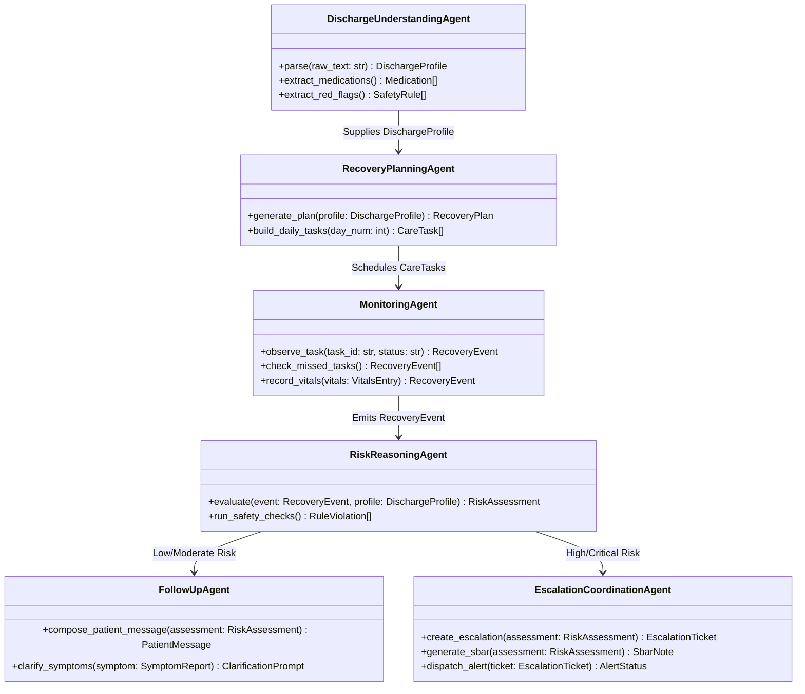

# CareBridge AI: Agent Specifications

This document defines the 6 specialized agents powering CareBridge AI, their responsibilities, input/output schemas, prompt strategies, and safety boundaries.

---

## Overview of the 6 Specialized Agents



---

## 1. Discharge Understanding Agent

### Purpose
Extracts and structures clinical information from unstructured discharge summaries, physician notes, or patient discharge packets.

### Responsibilities
- Parse primary and secondary diagnoses, surgical procedures, and inpatient stay dates.
- Extract all discharge medications: drug name, exact dosage, route, frequency, schedule slots (morning, noon, evening, bedtime), indication, and discontinued prior medications.
- Extract red-flag warning signs explicitly highlighted in the document (e.g., "Call doctor if temp > 101.5°F", "Sudden shortness of breath").
- Extract dietary restrictions, physical activity limits (e.g., "Do not lift > 10 lbs for 6 weeks"), and wound dressing protocols.
- Extract scheduled follow-up appointments (provider, clinic name, date/time, contact number).

### Input & Output Schema
- **Input:** `RawDischargeDocument` (Plaintext string or OCR document payload).
- **Output:** `DischargeProfile` (Pydantic validated model).

### System Prompt Directive
```text
You are the CareBridge Discharge Understanding Agent.
Your duty is to parse raw clinical discharge summaries into structured, validated JSON conforming to the DischargeProfile schema.
CRITICAL SAFETY RULES:
- Never assume a medication dosage if missing; flag it as "unspecified".
- Explicitly identify discontinued prior medications to prevent accidental post-discharge double-dosing.
- Extract all "When to call the doctor" and "Emergency warning signs" verbatim into the red_flags array.
```

---

## 2. Recovery Planning Agent

### Purpose
Translates the clinical `DischargeProfile` into an actionable, empathetic, patient-friendly recovery roadmap and daily task schedule.

### Responsibilities
- Break down the 30-day post-discharge timeline into manageable clinical phases:
  - *Phase 1 (Days 1–3):* Acute recovery, surgical pain control, wound stabilization, resting vitals baseline.
  - *Phase 2 (Days 4–7):* Gradual mobility, early rehabilitation, wound suture/staple assessment.
  - *Phase 3 (Days 8–14):* Physical therapy milestone, clinic follow-up preparation.
  - *Phase 4 (Days 15–30):* Full recovery transition, long-term medication adherence.
- Generate day-by-day `CareTask` instances:
  - Medication adherence checkpoints (pre-set alarm slots).
  - Vitals checks (e.g., daily dry weight before breakfast for CHF, BP twice daily for CABG).
  - Wound / incision inspections.
  - Hydration and dietary tracking checkpoints.

### Input & Output Schema
- **Input:** `DischargeProfile`, `PatientPreferences` (e.g., wake time, sleep time).
- **Output:** `RecoveryPlan`, array of `CareTask`.

---

## 3. Monitoring Agent

### Purpose
Acts as the continuous "OBSERVE" sensor of the system, tracking patient adherence, vital trends, and uncompleted recovery tasks.

### Responsibilities
- Monitor scheduled `CareTask` statuses (`PENDING`, `COMPLETED`, `MISSED`, `SKIPPED`).
- Detect non-adherence patterns (e.g., 2 consecutive missed anticoagulant doses).
- Ingest patient-reported check-in data (temperature, weight, blood pressure, blood glucose).
- Maintain timestamped `RecoveryEvent` telemetry for the audit log.

### Failure Handling
- If a patient misses a high-risk medication check (e.g., Plavix, Lovenox, Insulin), the Monitoring Agent immediately dispatches a `MISSED_HIGH_RISK_MED` event to the Risk/Reasoning Agent.

---

## 4. Risk / Reasoning Agent

### Purpose
The cognitive engine of the system. Evaluates reported patient events against documented discharge instructions and clinical safety guardrails.

### Responsibilities
- Execute deterministic safety checks via the `Deterministic Safety Engine`:
  - Immediate red-flag trigger on critical vitals (e.g., BP > 180/110, Pulse > 130, Temp > 101.5°F, Weight +3 lbs in 24h).
- Contextual reasoning:
  - Compare reported symptoms against known normal post-op expectations vs. danger signs.
  - Correlate missed medications with emerging symptoms (e.g., missed beta blocker + reported palpitations).
- Formulate a structured `RiskAssessment`:
  - `risk_level`: `LOW` | `MODERATE` | `HIGH` | `CRITICAL`.
  - `clinical_reasoning`: Transparent explanation of why this risk level was assigned.
  - `flagged_rules`: List of triggered safety rules or discharge warnings.
  - `recommended_action`: Direct to Follow-Up Agent OR Escalation Agent.

### Non-Diagnostic Guarantee
The agent reasons for **triage and escalation prioritization only**. It never generates a diagnosis or dictates pharmaceutical therapy.

---

## 5. Follow-Up Agent

### Purpose
Manages low-to-moderate risk interactions, delivering empathetic, reassuring, patient-friendly guidance and gathering symptom clarifications.

### Responsibilities
- Respond to patient queries using clear, compassionate, 6th-grade reading level language.
- Provide reassurance grounded *exclusively* in the patient's discharge instructions (e.g., *"Your instructions note that mild bruising around the incision is normal. However, let's keep an eye on it."*).
- Ask clarifying questions to refine context (e.g., *"On a scale of 1 to 10, how severe is the discomfort? Is there any swelling or fluid leaking?"*).
- Schedule follow-up check-ins (e.g., re-check in 4 hours).

---

## 6. Escalation / Coordination Agent

### Purpose
Handles high and critical risk events. Bridges the gap between the patient and the hospital care team to prevent adverse outcomes and avoidable readmissions.

### Responsibilities
- Generate standardized **SBAR Clinical Notes** for the healthcare team:
  - **S (Situation):** Immediate acute symptom or safety violation.
  - **B (Background):** Surgical procedure, admission dates, relevant medical history.
  - **A (Assessment):** Agent reasoning trace, triggered safety thresholds, vitals deviation.
  - **R (Recommendation):** Recommended clinical review, urgent outpatient contact, or ER triage.
- Open an `EscalationTicket` on the Clinical Team Dashboard with high-visibility visual badges.
- Deliver immediate, protective directives to the patient:
  - *"We have alerted your care team about your symptoms. Please do not wait: if you experience severe shortness of breath, chest pain, or sudden weakness, call 911 immediately."*
