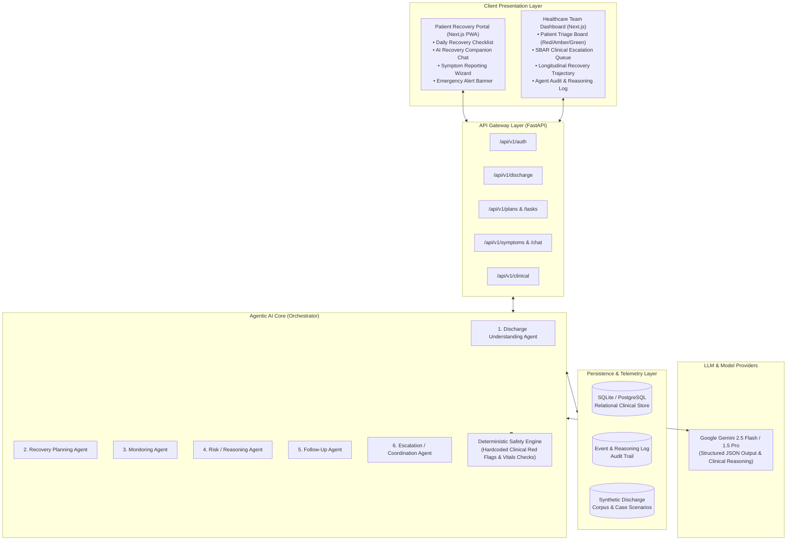
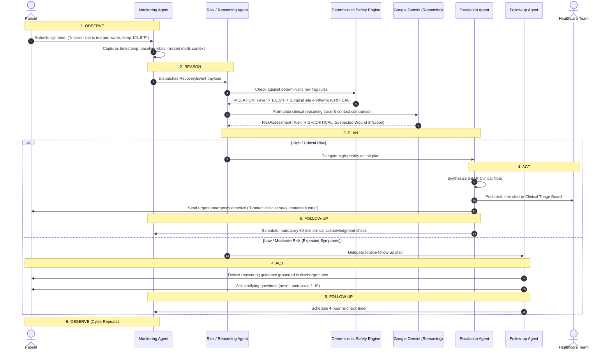

# CareBridge AI: System Architecture Specification

## 1. Problem Statement: "Nobody Owns the Patient After Discharge"

Post-discharge care transition is one of the most hazardous and expensive phases in modern healthcare:
- **Clinical Information Overload:** Upon discharge, patients are handed 10–25 pages of clinical discharge instructions containing technical medical terms, complex drug titration regimens, wound dressing protocols, activity limits, and red-flag warning signs.
- **Cognitive Deficit at Transition:** Patients are fatigued, recovering from anesthesia, medicated, or anxious. Studies show over 50% of patients fail to understand or retain discharge instructions within 24 hours.
- **The "Care Void":** In traditional outpatient workflows, hospital teams receive zero feedback between discharge and the routine 14–30 day follow-up clinic visit. Complications often spiral unchecked until a catastrophic 911 emergency call or avoidable 30-day readmission occurs.
- **CareBridge AI Solution:** An intelligent, proactive, continuous care coordination system that bridges this gap—translating discharge instructions into structured daily plans, monitoring recovery milestones, evaluating reported symptoms against documented discharge orders, and alerting the clinical team proactively when red flags emerge.

---

## 2. High-Level System Architecture

CareBridge AI utilizes an asynchronous, event-driven decoupled architecture:

---

## 3. The Core Agentic Loop: OBSERVE → REASON → PLAN → ACT → FOLLOW-UP → OBSERVE

CareBridge AI operates on a continuous cybernetic feedback loop designed for patient recovery safety:

---

## 4. Dual-Layer Safety Architecture

To guarantee patient safety and zero clinical hallucinations, the system strictly implements **two distinct evaluation layers**:

### Layer 1: Deterministic Clinical Safety Engine (Pre-LLM & Non-Bypassing)
- Evaluates hard thresholds defined by the hospital's clinical protocols.
- Directly intercepts inputs *before or in parallel with* LLM reasoning.
- If a hard rule triggers (e.g., systolic blood pressure > 180 mmHg, acute chest pain post-CABG, sudden unilateral leg swelling post-TKA, fever > 101.5°F), the event is immediately elevated to `HIGH` or `CRITICAL` risk regardless of any generative model output.

### Layer 2: Contextual Agentic Reasoning Layer
- Evaluates multi-variable, qualitative, or temporal trends that simple rule engines miss (e.g., a patient who skipped 2 doses of beta-blockers and reports progressive dizziness when standing up).
- Grounded strictly in the ingested `DischargeProfile`.
- Restricted by strict system prompts prohibiting diagnostic declarations or dosage changes.

---

## 5. Non-Negotiable System Guardrails & Ethics

1. **No Diagnosis:** The system must never inform a patient "You have an infection" or "You have a pulmonary embolism." It states: *"Your reported symptoms (fever and warmth around your incision) require prompt evaluation by your surgical care team."*
2. **No Prescription or Dosage Modification:** The system must never say "Take an extra 5mg of lisinopril." It states: *"Your discharge instructions state to take your blood pressure medication as prescribed. Please contact your physician before making any adjustments."*
3. **Continuous Medical Disclaimer:** Every patient-facing interaction includes an unobtrusive yet clear notice: *"CareBridge AI is an administrative recovery coordinator, not a doctor. If you are experiencing a life-threatening emergency, call 911 immediately."*
4. **Zero Hallucinated Contacts:** Emergency contacts, clinic phone numbers, and surgeon details must only come from the ingested discharge document or system configuration.

---

## 6. Synthetic Data Strategy (HIPAA & Privacy Compliance)

Under no circumstances is real Protected Health Information (PHI) used. CareBridge AI provides 4 clinically realistic synthetic patient profiles:
- **Case 1: James Harrison (Post-CABG x3):** Coronary artery bypass graft recovery; sternal precautions; dual antiplatelets; wound monitoring.
- **Case 2: Elena Rostova (Total Knee Arthroplasty):** Joint replacement recovery; anticoagulation compliance (Lovenox/Eliquis); knee flexion exercises; DVT vigilance.
- **Case 3: Marcus Vance (Congestive Heart Failure):** Acute exacerbation post-discharge; strict daily weights; sodium restriction (<2000mg); diuretic titration compliance.
- **Case 4: Sarah Chen (Community-Acquired Pneumonia):** Antibiotic completion tracking; pulse oximetry monitoring; pleuritic chest symptom logging.
