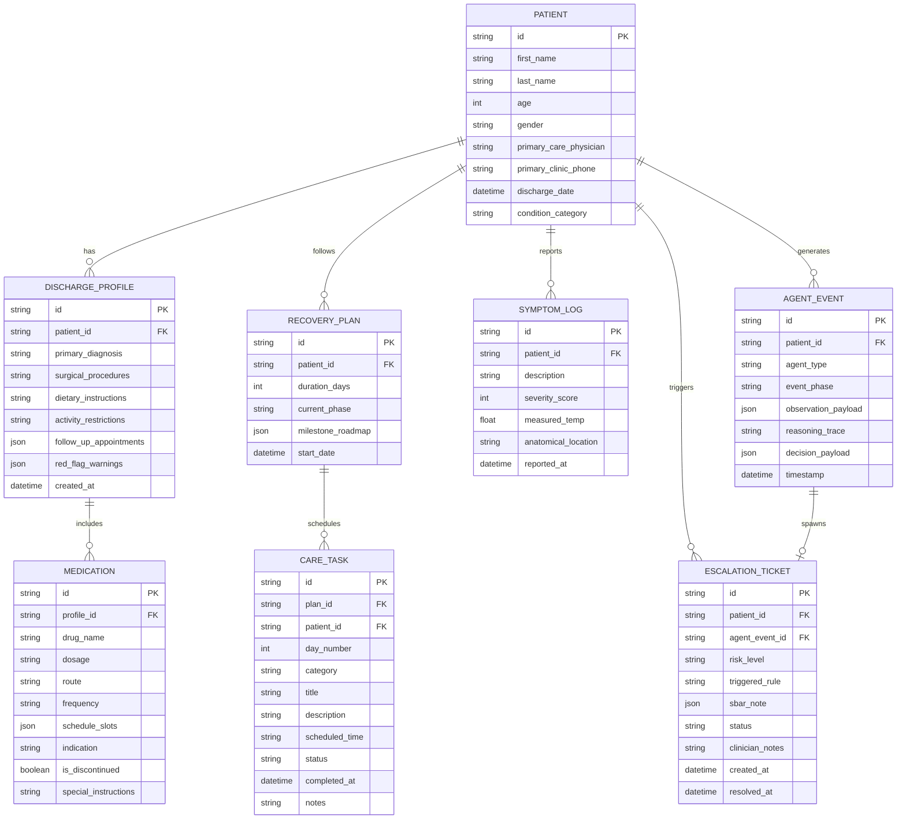

# CareBridge AI: Data Models & Schema Design

This document details the relational database schema and Pydantic v2 data models used across CareBridge AI.

---

## 1. Entity-Relationship Diagram



---

## 2. Core Enumerations

```python
from enum import Enum

class RiskLevel(str, Enum):
    LOW = "LOW"
    MODERATE = "MODERATE"
    HIGH = "HIGH"
    CRITICAL = "CRITICAL"

class TaskCategory(str, Enum):
    MEDICATION = "MEDICATION"
    VITAL_CHECK = "VITAL_CHECK"
    WOUND_CARE = "WOUND_CARE"
    PHYSICAL_THERAPY = "PHYSICAL_THERAPY"
    HYDRATION_DIET = "HYDRATION_DIET"
    CHECK_IN = "CHECK_IN"

class TaskStatus(str, Enum):
    PENDING = "PENDING"
    COMPLETED = "COMPLETED"
    MISSED = "MISSED"
    SKIPPED = "SKIPPED"

class AgentPhase(str, Enum):
    OBSERVE = "OBSERVE"
    REASON = "REASON"
    PLAN = "PLAN"
    ACT = "ACT"
    FOLLOW_UP = "FOLLOW_UP"

class TicketStatus(str, Enum):
    OPEN = "OPEN"
    IN_REVIEW = "IN_REVIEW"
    RESOLVED = "RESOLVED"
```

---

## 3. Pydantic v2 Core Clinical Schemas

The following models define the typed data contract between backend agents, storage, and the frontend:

### `DischargeProfile`
```python
class FollowUpAppointment(BaseModel):
    provider: str
    specialty: str
    clinic_name: str
    date_time: str
    contact_number: str

class MedicationItem(BaseModel):
    drug_name: str
    dosage: str
    route: str
    frequency: str
    schedule_slots: list[str]  # e.g., ["08:00", "20:00"]
    indication: str
    is_discontinued: bool = False
    warning: str | None = None

class DischargeProfile(BaseModel):
    patient_id: str
    primary_diagnosis: str
    procedures: list[str]
    discharge_date: str
    dietary_instructions: str
    activity_restrictions: str
    medications: list[MedicationItem]
    red_flag_warnings: list[str]
    follow_up_appointments: list[FollowUpAppointment]
```

### `RiskAssessment` & `SbarNote`
```python
class SbarNote(BaseModel):
    situation: str
    background: str
    assessment: str
    recommendation: str

class RiskAssessment(BaseModel):
    patient_id: str
    risk_level: RiskLevel
    deterministic_rule_triggered: str | None = None
    clinical_reasoning: str
    confidence_score: float
    immediate_patient_directive: str
    care_team_action_required: bool
    sbar: SbarNote | None = None
```
