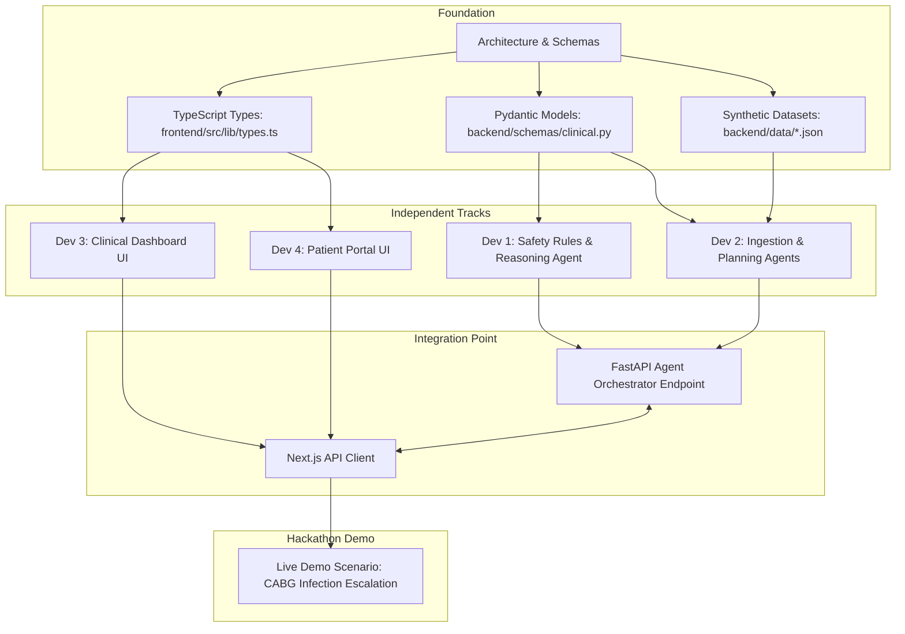

# CareBridge AI: 4-Developer Hackathon Roadmap & Execution Plan

This roadmap organizes the development of CareBridge AI across a 4-member hackathon team to guarantee high-velocity execution with zero overlapping file collisions or merge blocks.

---

## 1. Developer Ownership Matrix

| Developer | Primary Role | Core Directory Ownership | Core Deliverables |
| :--- | :--- | :--- | :--- |
| **Dev 1 (Lead AI & Safety)** | AI Reasoning & Orchestration Lead | `backend/app/agents/` (Reasoning, Followup, Escalation), `backend/app/core/safety_rules.py` | Deterministic safety rule engine, Risk Assessment Agent, SBAR note generator, Agent loop runner |
| **Dev 2 (Backend & Data)** | Ingestion, Planning & Persistence Lead | `backend/app/agents/` (Discharge, Planning), `backend/app/db/`, `backend/app/api/v1/`, `backend/app/data/` | Discharge Understanding Agent, Recovery Planning Agent, SQLite models, REST endpoints, synthetic datasets |
| **Dev 3 (Clinical Frontend)** | Healthcare Provider Experience Lead | `frontend/src/app/clinical/`, `frontend/src/components/clinical/` | Clinical Triage Board, SBAR handoff viewer, Escalation management, Risk badges, Patient drill-down |
| **Dev 4 (Patient Frontend)** | Patient Recovery Experience Lead | `frontend/src/app/patient/`, `frontend/src/components/patient/` | Mobile-first recovery checklist, AI Companion Chat interface, Symptom logging modal, Red-flag alert banner |

---

## 2. Stage Breakdown & Execution Timeline

```mermaid
gantt
    title CareBridge AI 4-Stage Hackathon Plan
    dateFormat  YYYY-MM-DD
    section Stage 1: Foundation
    Architecture, Schemas & Synthetic Data (Completed) :done, s1, 2026-09-18, 1d
    Contracts Verification & Scaffolding (Completed)      :done, s2, 2026-09-18, 1d

    section Stage 2: Independent Subsystems
    Dev 1: Safety Engine & Risk Reasoning Agent          :active, d1, 2026-09-19, 1d
    Dev 2: Discharge Parsing & Recovery Plan Generator   :active, d2, 2026-09-19, 1d
    Dev 3: Clinical Triage Dashboard UI (Mocked)         :active, d3, 2026-09-19, 1d
    Dev 4: Patient Checklist & Companion Chat UI (Mocked) :active, d4, 2026-09-19, 1d

    section Stage 3: Integration & Agent Loop
    End-to-end OBSERVE->REASON->ACT Loop Wiring           :crit, int1, 2026-09-20, 1d
    Connect Frontend to FastAPI Live Endpoints            :crit, int2, 2026-09-20, 1d

    section Stage 4: Polish & Demo
    Synthetic Case Demonstrations & Stress Testing        :p1, 2026-09-21, 1d
    Hackathon Pitch Deck & Demo Walkthrough Recording     :p2, 2026-09-21, 1d
```

---

## 3. Dependency Mapping Between Stages



### Critical Path & Non-Blocking Workflow
- **Day 1 Focus (Foundation):** Lock down `clinical.py` and `types.ts`. Frontend developers (Dev 3 & 4) immediately build rich interactive UI components using the synthetic datasets in `synthetic-data.ts` with zero backend dependencies.
- **Day 2 Focus (Agents & Subsystems):** Dev 1 builds safety logic and Gemini prompting for clinical risk assessment. Dev 2 implements the document parser and task milestone generator.
- **Day 3 Focus (Wire-Up):** Replace client-side mock fetchers with live FastAPI endpoints.
- **Day 4 Focus (Live Demo Polish):** Rehearse the 3-minute hackathon pitch showing the complete loop:
  1. Doctor uploads CABG discharge note -> Discharge Understanding Agent parses it into 30-day plan.
  2. Patient checks in on Day 2 -> marks morning meds -> logs temperature 101.8°F and incision redness.
  3. Safety Engine + Risk/Reasoning Agent triggers `CRITICAL` risk escalation.
  4. Clinical Dashboard instantly lights up with an urgent triage alert and auto-generated SBAR note.
  5. Patient receives immediate reassuring protective instruction ("We have alerted Dr. Jenkins' team; do not apply ointments...").

---

## 4. Quality Checklist Before Hackathon Submission

- [ ] Zero PHI: Verify all 4 demo profiles use synthetic names, fake phone numbers, and generated hospital IDs.
- [ ] Disclaimer Visibility: Ensure medical disclaimers are visible on both patient and clinical pages.
- [ ] SBAR Completeness: Verify SBAR notes accurately capture Situation, Background, Assessment, and Recommendation.
- [ ] Safety Rule Determinism: Ensure systolic BP > 180 or temp > 101.5°F triggers escalation even if simulated offline without LLM.
- [ ] Responsive UI: Check mobile viewport compatibility for patient checklist and wide viewport for clinical triage board.
