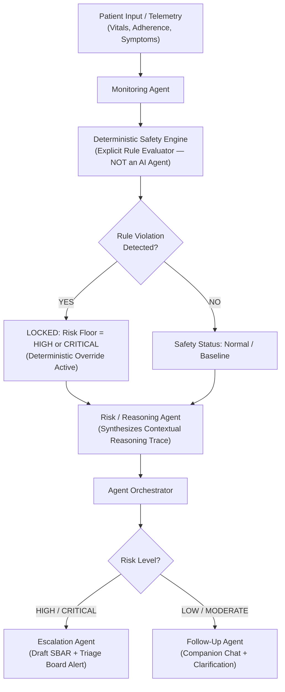

# CareBridge AI: Clinical Safety, Guardrails & Legal Boundaries

> **Operational Prototype Disclaimer:**
> CareBridge AI is an **Agentic AI healthcare decision-support and care-coordination prototype**. It is **NOT** an autonomous medical decision-maker and does **NOT** replace licensed physicians, nurses, or emergency clinical personnel.

---

## 1. System Authority & Safety Boundaries

### 1.1 Non-Negotiable Clinical Prohibitions
To ensure complete clinical safety and regulatory alignment, the AI components are explicitly prohibited from:
- ❌ **Diagnosing diseases or medical conditions:** The AI must never state *"You have an infection"*, *"You have heart failure"*, or assign diagnostic codes.
- ❌ **Prescribing pharmaceuticals or remedies:** The AI must never recommend or order medications.
- ❌ **Modifying medication dosages or schedules:** The AI must never advise increasing, decreasing, or discontinuing medication.
- ❌ **Altering clinical care or post-operative treatment regimens:** Care plans must strictly mirror the documented discharge instructions.
- ❌ **Making final clinical or triage decisions:** The system provides decision-support only; final triage determinations belong exclusively to human clinicians.
- ❌ **Replacing licensed healthcare professionals or emergency services.**

### 1.2 Authorized Autonomous Workflow Actions
The platform is authorized to autonomously execute care-coordination operations:
- ✅ **Creating recovery tasks** and personalizing daily milestone roadmaps based on hospital discharge orders.
- ✅ **Tracking patient adherence** to prescribed medications, physical therapy, and vitals checks.
- ✅ **Recording recovery events** and longitudinal telemetry in the clinical store.
- ✅ **Evaluating deterministic safety rules** against configured physiological thresholds.
- ✅ **Creating follow-up tasks** and scheduling automated re-check timers for mild concerns.
- ✅ **Generating real-time alerts** on the Healthcare Team Dashboard.
- ✅ **Generating draft SBAR clinical notes** clearly watermarked as AI-generated drafts requiring clinical review.
- ✅ **Updating recovery timelines** as milestones are achieved.
- ✅ **Preparing longitudinal recovery summaries** for outpatient clinical follow-up consultations.

---

## 2. Deterministic Safety Engine (NOT an AI Agent)

The **Deterministic Safety Engine** is an algorithmic, zero-hallucination evaluation component—**it is NOT an AI agent**.

### 2.1 The Precedence Principle
Deterministic safety rules **strictly take precedence over LLM reasoning**.
- If a patient-reported parameter breaches an explicit, configured clinical threshold (e.g., patient temperature $= 101.8^\circ\text{F}$ against a configured discharge warning threshold of $101.5^\circ\text{F}$), the safety engine deterministically detects the rule violation.
- The generative LLM **must not override, soften, or downgrade** that result.
- The event is deterministically locked to at least **`HIGH`** or **`CRITICAL`** risk, routing to the **Escalation / Coordination Agent** to notify the healthcare team.



---

## 3. Pre-Configured Deterministic Safety Rules

| Rule Identifier | Parameter Monitored | Configured Threshold | Action Triggered | Risk Floor |
| :--- | :--- | :--- | :--- | :--- |
| `RULE-VITAL-TEMP` | Core Body Temperature | $\ge 101.5^\circ\text{F}\ (38.6^\circ\text{C})$ | Immediate Infection Escalation | **HIGH** |
| `RULE-VITAL-BP-SYS` | Systolic Blood Pressure | $\ge 180\text{ mmHg}$ or $\le 85\text{ mmHg}$ | Hypertensive Emergency / Shock Directive | **CRITICAL** |
| `RULE-VITAL-BP-DIA` | Diastolic Blood Pressure | $\ge 110\text{ mmHg}$ or $\le 50\text{ mmHg}$ | Severe BP Deviation Alert | **HIGH** |
| `RULE-VITAL-SPO2` | Oxygen Saturation ($SpO_2$) | $\le 90\%$ (or $\le 88\%$ for COPD) | Hypoxia Alert & Emergency Protocol | **CRITICAL** |
| `RULE-VITAL-HR` | Heart Rate | $\ge 130\text{ bpm}$ or $\le 45\text{ bpm}$ | Tachycardia / Bradycardia Alert | **HIGH** |
| `RULE-CHF-WEIGHT` | Dry Weight (CHF Patient) | $\ge 3\text{ lbs in 24h}$ or $\ge 5\text{ lbs in 7d}$ | Fluid Overload / Decompensation Alert | **HIGH** |
| `RULE-SYMP-CHEST` | Symptom Description | Keywords: "chest pain", "pressure", "radiating" | Immediate 911 Emergency Directive | **CRITICAL** |
| `RULE-SYMP-DVT` | Post-op Limb Symptoms | Keywords: "calf swelling", "hot calf", "leg pain" | Urgent Outpatient DVT Evaluation Alert | **HIGH** |
| `RULE-MED-ANTICOAG`| Anticoagulant Compliance | 2 consecutive missed anticoagulant doses | Thromboembolic Risk Escalation | **HIGH** |

---

## 4. Draft SBAR Note Clinical Review Standards

To prevent unverified AI outputs from directly dictating patient care, all SBAR notes generated by the **Escalation / Coordination Agent** must adhere to the following standards:

1. **Mandatory Header Watermark:**
   ```text
   ================================================================================
   ⚠️ AI-GENERATED DRAFT — REQUIRES HEALTHCARE PROFESSIONAL CLINICAL REVIEW
   This communication was generated by CareBridge AI as clinical decision support.
   It does not constitute a verified clinical order or diagnosis.
   Validate all data points with the patient before taking clinical action.
   ================================================================================
   ```
2. **Clinician-in-the-Loop Sign-off:** An escalation ticket cannot be resolved or translated into an order without explicit review, notes, and authorization by a licensed nurse or physician.
3. **Auditability:** The original telemetry, deterministic rule result, raw LLM prompt, and generated draft SBAR note are immutably archived with cryptographic timestamps.
