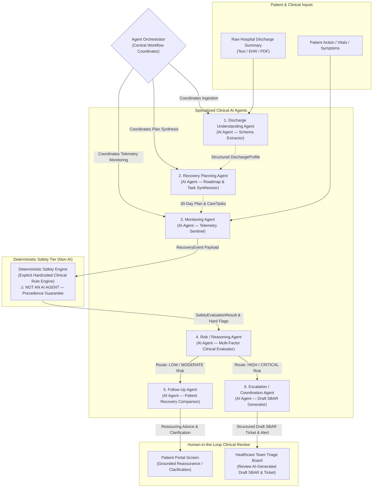
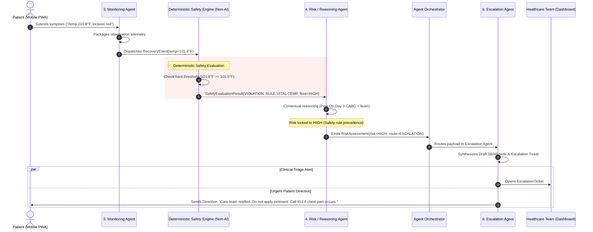

# CareBridge AI: Agent Architecture & Orchestration

> **Clinical Decision-Support Prototype Disclaimer:**
> CareBridge AI is an **Agentic AI healthcare decision-support and care-coordination prototype**. It is **NOT** an autonomous medical decision-maker and does **NOT** replace licensed physicians, nurses, or emergency clinical personnel.

---

## 1. System Authority & Safety Boundaries

### 1.1 Non-Negotiable Clinical Prohibitions
To preserve patient safety and prevent liability, the AI agents are strictly prohibited from:
- ❌ **Diagnosing diseases or clinical conditions** (e.g., cannot state *"You have a deep vein thrombosis"* or *"You have a wound infection"*).
- ❌ **Prescribing pharmaceuticals** or proposing medicinal therapy.
- ❌ **Modifying medication dosages** or altering intake schedules without physician-validated orders.
- ❌ **Altering clinical care or post-operative treatment plans**.
- ❌ **Making final triage or admission decisions**.
- ❌ **Replacing healthcare professionals** or clinical judgment.

### 1.2 Authorized Autonomous Workflow Actions
The system is authorized to autonomously execute operational care-coordination tasks:
- ✅ **Creating recovery tasks** and personalizing daily milestone roadmaps based on hospital discharge orders.
- ✅ **Tracking patient adherence** to prescribed medications, physical therapy, and vitals checks.
- ✅ **Recording recovery events** and longitudinal telemetry in the clinical store.
- ✅ **Evaluating deterministic safety rules** against configured physiological thresholds.
- ✅ **Creating follow-up tasks** and scheduling automated re-check timers for mild concerns.
- ✅ **Generating real-time alerts** on the Healthcare Team Dashboard.
- ✅ **Generating draft SBAR clinical notes** clearly watermarked as AI-generated drafts requiring clinical review.
- ✅ **Updating recovery timelines** as milestones are achieved.
- ✅ **Preparing longitudinal recovery summaries** for outpatient clinical follow-up consultations.

---

## 2. Architectural Structure: 6 Specialized AI Agents + 2 Core System Components

The system architecture cleanly distinguishes between **6 specialized AI agents** and **two non-AI infrastructural components**:

```
                    Agent Orchestrator
                           |
          +----------------+----------------+
          |                |                |
          v                v                v
 Discharge Understanding  Recovery       Monitoring
        Agent             Planning Agent     Agent
                                             |
                                             v
                                  Deterministic Safety
                                       Engine
                                             |
                                             v
                                   Risk/Reasoning Agent
                                             |
                                  +----------+----------+
                                  |                     |
                                  v                     v
                             Follow-Up Agent      Escalation Agent
```

### Component Categories

1. **The 6 Specialized AI Agents:**
   - **Discharge Understanding Agent:** Synthesizes structured `DischargeProfile` from unstructured clinical paperwork.
   - **Recovery Planning Agent:** Translates profile into 30-day milestone roadmap and granular daily `CareTask` items.
   - **Monitoring Agent:** Observes task compliance, ingests patient telemetry, and emits standardized `RecoveryEvent` objects.
   - **Risk/Reasoning Agent:** Evaluates patient context and safety-engine outputs to produce a structured `RiskAssessment`.
   - **Follow-Up Agent:** Delivers empathetic, non-diagnostic companion responses and symptom clarifications for low/moderate risk concerns.
   - **Escalation / Coordination Agent:** Dispatches high/critical risk alerts, generates draft SBAR notes, and provides protective directives.

2. **Deterministic Safety Engine (NOT an AI Agent):**
   - An algorithmic, zero-hallucination evaluation engine.
   - Tests physiological vitals and symptom keywords against explicit, configured clinical thresholds.
   - **Deterministic Precedence Guarantee:** Safety engine violations **strictly override** LLM reasoning. If a threshold is crossed (e.g., temperature $101.8^\circ\text{F} \ge 101.5^\circ\text{F}$), the risk level is deterministically locked to `HIGH` or `CRITICAL`. The LLM cannot downgrade or dismiss this finding.

3. **Agent Orchestrator:**
   - The central workflow coordinator of the platform.
   - Enforces execution sequence, coordinates agent lifecycles, manages state transitions, and routes structured events between components without mixing agent responsibilities.

---

## 3. End-to-End System Architecture Diagram



---

## 4. Agent Responsibilities & Detailed Interface Specifications

### 4.1 Discharge Understanding Agent (AI Agent)
- **Role:** Clinical Document Parser & Normalizer.
- **Responsibilities:**
  - Ingest raw discharge summaries, progress notes, or EHR exports.
  - Extract primary diagnosis, surgical interventions, inpatient stay dates, and precautions.
  - Parse complete medication schedules: drug name, exact dosage, route, frequency, schedule slots (e.g., `["08:00", "20:00"]`), and discontinued prior drugs.
  - Extract red-flag warning thresholds explicitly documented by discharging physicians into structured rules.
- **Input:** `RawDischargeDocument` (plaintext or structured text).
- **Output:** `DischargeProfile` (Pydantic validated model).
- **Constraint:** Must never invent missing medication dosages; flags missing values as `UNSPECIFIED`.

---

### 4.2 Recovery Planning Agent (AI Agent)
- **Role:** Milestone Roadmap & Daily Task Architect.
- **Responsibilities:**
  - Decompose the 30-day recovery timeline into four sequential clinical phases:
    - *Phase 1 (Days 1–3): Acute Stabilization & Rest* (pain control, sternal/incision protection, resting vitals).
    - *Phase 2 (Days 4–7): Early Mobilization & Wound Check* (light walking, suture/dressing check).
    - *Phase 3 (Days 8–14): Progressive Rehabilitation* (exercise tolerance, first outpatient clinic prep).
    - *Phase 4 (Days 15–30): Long-Term Independence* (sustainable lifestyle adherence).
  - Generate day-by-day `CareTask` instances (medication slots, daily dry weight, BP checks, incision checks).
- **Input:** `DischargeProfile`, `PatientPreferences`.
- **Output:** `RecoveryPlan`, array of `CareTask`.

---

### 4.3 Monitoring Agent (AI Agent)
- **Role:** Continuous Telemetry Sensor & Adherence Sentinel.
- **Responsibilities:**
  - Track scheduled task execution (`PENDING`, `COMPLETED`, `MISSED`, `SKIPPED`).
  - Ingest patient-reported check-in data (vitals, checklist actions, symptom reports).
  - Compute daily adherence percentages and rolling compliance trends.
  - Detect critical non-adherence patterns (e.g., missed anticoagulant or antiplatelet doses).
  - Package observations into typed `RecoveryEvent` objects and pass them directly to the **Deterministic Safety Engine**.
- **Input:** `TaskStatusUpdate`, `VitalsMeasurement`, `SymptomSubmission`.
- **Output:** `RecoveryEvent`.

---

### 4.4 Deterministic Safety Engine (Non-AI System Component)
- **Role:** Algorithmic Clinical Safety Rule Evaluator (**NOT an AI Agent**).
- **Responsibilities:**
  - Evaluates explicit, configured safety rules deterministically against incoming vitals and reported symptom keywords.
  - Executes prior to or in parallel with LLM reasoning.
  - **Enforces Deterministic Precedence:** If any configured threshold is breached (e.g., Core Temp $\ge 101.5^\circ\text{F}$, Systolic BP $\ge 180\text{ mmHg}$, Weight $\ge +3\text{ lbs in 24h}$), it deterministically asserts a rule violation and forces the risk floor to `HIGH` or `CRITICAL`.
- **Input:** `RecoveryEvent`, `ConfiguredSafetyRules` (from `DischargeProfile`).
- **Output:** `SafetyEvaluationResult` (violation flags, rule IDs, deterministic risk floor).

---

### 4.5 Risk / Reasoning Agent (AI Agent)
- **Role:** Multi-Factor Clinical Risk Reasoning Engine.
- **Responsibilities:**
  - Ingest the `SafetyEvaluationResult` from the Deterministic Safety Engine alongside historical patient recovery context.
  - Synthesize a transparent clinical reasoning trace combining safety violations, missed medications, and patient recovery trajectory.
  - Categorize risk into: `LOW`, `MODERATE`, `HIGH`, or `CRITICAL`.
  - **Precedence Rule:** If `SafetyEvaluationResult.has_violation == True`, the risk level cannot be downgraded below the safety engine's risk floor.
  - Output a structured `RiskAssessment` to the **Agent Orchestrator**.
- **Input:** `SafetyEvaluationResult`, `RecoveryEvent`, `DischargeProfile`.
- **Output:** `RiskAssessment`.

---

### 4.6 Agent Orchestrator (System Coordinator)
- **Role:** Central Event Coordinator & State Router.
- **Responsibilities:**
  - Evaluates `RiskAssessment.risk_level` and routes structured payloads:
    - If `LOW` or `MODERATE` $\longrightarrow$ Route to **Follow-Up Agent**.
    - If `HIGH` or `CRITICAL` $\longrightarrow$ Route to **Escalation / Coordination Agent**.
  - Persists state changes and telemetry to the database.

---

### 4.7 Follow-Up Agent (AI Agent)
- **Role:** Patient Recovery Companion & Conversational Clarifier.
- **Responsibilities:**
  - Respond to low/moderate risk queries in empathetic, accessible language (6th-grade reading level).
  - Ground all advice strictly in the ingested `DischargeProfile`.
  - Inquire about symptom nuances (onset time, 1–10 pain scale, swelling) to enrich clinical context.
  - Schedule automated follow-up check-ins (e.g., 4-hour re-check timer).
- **Input:** `RiskAssessment`, `PatientMessage`, `DischargeProfile`.
- **Output:** `PatientCompanionResponse`, scheduled follow-up timer.

---

### 4.8 Escalation / Coordination Agent (AI Agent)
- **Role:** Clinical Emergency Triage & Draft SBAR Note Generator.
- **Responsibilities:**
  - Ingest high and critical risk assessments.
  - Synthesize structured **Draft SBAR Clinical Notes** for the healthcare team:
    - **S (Situation):** Immediate acute symptom or safety rule breach.
    - **B (Background):** Surgical procedure, admission dates, relevant medical history.
    - **A (Assessment):** Agent reasoning trace, vitals trend deviation, flagged red flags.
    - **R (Recommendation):** Recommended clinical review, urgent outpatient contact, or ER triage.
  - **Mandatory Watermark:** Clearly tag every SBAR note as an AI-generated draft requiring clinical validation.
  - Open an `EscalationTicket` on the Clinical Team Dashboard.
  - Dispatch immediate protective directives to the patient.
- **Input:** `RiskAssessment`, `DischargeProfile`, `PatientContactDetails`.
- **Output:** `EscalationTicket`, `DraftSbarNote`, `PatientUrgentDirective`.

---

## 5. Agent Communication & Event Flow



---

## 6. Deterministic Safety Precedence Matrix

| Rule ID | Monitored Parameter | Threshold Condition | Deterministic Safety Action | Precedence Risk Floor |
| :--- | :--- | :--- | :--- | :--- |
| `RULE-VITAL-TEMP` | Core Temperature | $\ge 101.5^\circ\text{F}\ (38.6^\circ\text{C})$ | Immediate Infection Escalation | **HIGH** |
| `RULE-VITAL-BP-SYS` | Systolic Blood Pressure | $\ge 180\text{ mmHg}$ or $\le 85\text{ mmHg}$ | Hypertensive Emergency / Shock Alert | **CRITICAL** |
| `RULE-VITAL-BP-DIA` | Diastolic Blood Pressure | $\ge 110\text{ mmHg}$ or $\le 50\text{ mmHg}$ | Severe BP Deviation Alert | **HIGH** |
| `RULE-VITAL-SPO2` | Oxygen Saturation ($SpO_2$) | $\le 90\%$ (or $\le 88\%$ for COPD) | Hypoxia Alert & Emergency Protocol | **CRITICAL** |
| `RULE-VITAL-HR` | Heart Rate | $\ge 130\text{ bpm}$ or $\le 45\text{ bpm}$ | Tachycardia / Bradycardia Alert | **HIGH** |
| `RULE-CHF-WEIGHT` | Dry Weight (CHF Patient) | $\ge 3\text{ lbs in 24h}$ or $\ge 5\text{ lbs in 7d}$ | Fluid Overload / Decompensation Alert | **HIGH** |
| `RULE-SYMP-CHEST` | Symptom Keywords | "chest pain", "pressure", "radiating" | Immediate 911 Emergency Directive | **CRITICAL** |
| `RULE-SYMP-DVT` | Post-op Limb Symptoms | "calf swelling", "hot calf", "leg pain" | Urgent Outpatient DVT Evaluation Alert | **HIGH** |
| `RULE-MED-ANTICOAG`| Anticoagulant Compliance | 2 consecutive missed anticoagulant doses | Thromboembolic Risk Escalation | **HIGH** |

---

## 7. Draft SBAR Note Clinical Disclaimer Standard

All generated SBAR notes must incorporate the following standardized metadata and visual header:

```text
================================================================================
⚠️ AI-GENERATED DRAFT — REQUIRES HEALTHCARE PROFESSIONAL REVIEW & VALIDATION
This summary was synthesized by CareBridge AI as clinical decision support.
It does NOT constitute a diagnosis or physician order. Validate clinically.
================================================================================
S (Situation): ...
B (Background): ...
A (Assessment): ...
R (Recommendation): ...
```
