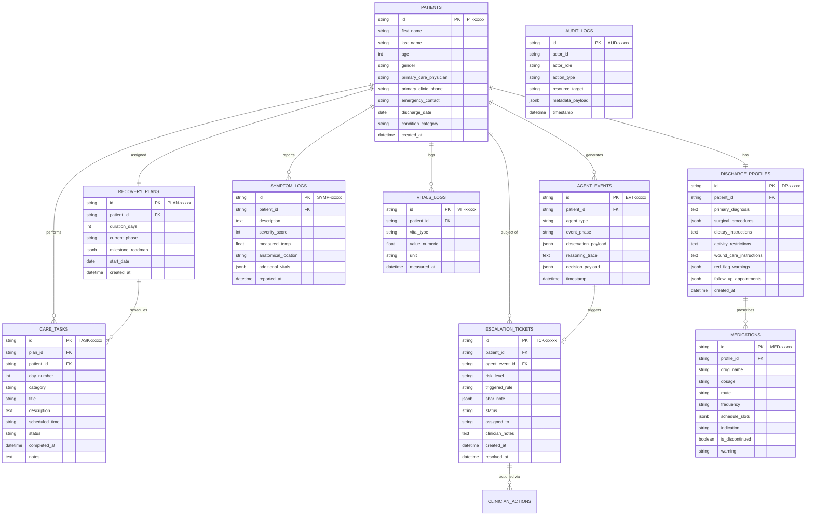

# CareBridge AI: Database Architecture & Entity Design

## 1. Relational Database Overview

CareBridge AI utilizes a relational data model designed for high referential integrity, auditability, and temporal recovery tracking. The schema is standardized across:
- **Production:** PostgreSQL 15+ (with connection pooling via PgBouncer and Row-Level Security).
- **Development & Testing:** SQLite 3 (WAL mode enabled for concurrent reads).



---

## 2. Table Specifications & Data Dictionary

### 2.1 `patients`
Stores demographic, admission, and emergency contact details for enrolled patients.

| Column | Type | Constraints | Description |
| :--- | :--- | :--- | :--- |
| `id` | `VARCHAR(32)` | `PRIMARY KEY` | Format: `PT-CABG-001`, `PT-TKA-002` |
| `first_name` | `VARCHAR(64)` | `NOT NULL` | Patient given name |
| `last_name` | `VARCHAR(64)` | `NOT NULL` | Patient family name |
| `age` | `INTEGER` | `CHECK (age > 0)` | Patient age in years |
| `gender` | `VARCHAR(16)` | `NOT NULL` | E.g., `Male`, `Female`, `Other` |
| `primary_care_physician` | `VARCHAR(128)` | `NOT NULL` | Discharging physician or surgical lead |
| `primary_clinic_phone` | `VARCHAR(32)` | `NOT NULL` | Clinic telephone number |
| `emergency_contact` | `VARCHAR(128)` | `NOT NULL` | Name, relation & phone number of proxy |
| `discharge_date` | `DATE` | `NOT NULL` | Hospital discharge date |
| `condition_category` | `VARCHAR(64)` | `NOT NULL` | E.g., `Cardiac Surgery`, `Orthopedic`, `Heart Failure` |
| `created_at` | `TIMESTAMP WITH TIME ZONE` | `DEFAULT NOW()` | Record creation timestamp |

---

### 2.2 `discharge_profiles`
Maintains the structured clinical profile generated by the Discharge Understanding Agent.

| Column | Type | Constraints | Description |
| :--- | :--- | :--- | :--- |
| `id` | `VARCHAR(32)` | `PRIMARY KEY` | Format: `DP-xxxxx` |
| `patient_id` | `VARCHAR(32)` | `REFERENCES patients(id) ON DELETE CASCADE` | Target patient |
| `primary_diagnosis` | `TEXT` | `NOT NULL` | Clinical diagnosis (e.g., CAD post-CABG) |
| `surgical_procedures` | `JSONB` | `NOT NULL` | Array of strings: procedures performed |
| `dietary_instructions` | `TEXT` | `NOT NULL` | Sodium, fluid, or diabetic meal guidelines |
| `activity_restrictions` | `TEXT` | `NOT NULL` | Sternal precautions, weight-bearing limits |
| `wound_care_instructions`| `TEXT` | `NOT NULL` | Cleansing, dressing change, and bathing rules |
| `red_flag_warnings` | `JSONB` | `NOT NULL` | Array of verbatim warning signs |
| `follow_up_appointments`| `JSONB` | `NOT NULL` | Array of structured appointment objects |
| `created_at` | `TIMESTAMP WITH TIME ZONE` | `DEFAULT NOW()` | Record creation timestamp |

---

### 2.3 `medications`
Normalizes discharge medications extracted from the clinical paperwork.

| Column | Type | Constraints | Description |
| :--- | :--- | :--- | :--- |
| `id` | `VARCHAR(32)` | `PRIMARY KEY` | Format: `MED-xxxxx` |
| `profile_id` | `VARCHAR(32)` | `REFERENCES discharge_profiles(id) ON DELETE CASCADE` | Owning profile |
| `drug_name` | `VARCHAR(128)` | `NOT NULL` | Generic/brand name (e.g., Metoprolol) |
| `dosage` | `VARCHAR(64)` | `NOT NULL` | E.g., `50 mg`, `81 mg` |
| `route` | `VARCHAR(32)` | `NOT NULL` | E.g., `Oral`, `Subcutaneous` |
| `frequency` | `VARCHAR(128)` | `NOT NULL` | E.g., `Once daily in the morning` |
| `schedule_slots` | `JSONB` | `NOT NULL` | Clock time array: `["08:00"]` |
| `indication` | `VARCHAR(256)` | `NOT NULL` | Reason for medication |
| `is_discontinued` | `BOOLEAN` | `DEFAULT FALSE` | True if prior med was stopped at discharge |
| `warning` | `TEXT` | `NULL` | Black box or clinical precautions |

---

### 2.4 `recovery_plans` & `care_tasks`

#### `recovery_plans`
| Column | Type | Constraints | Description |
| :--- | :--- | :--- | :--- |
| `id` | `VARCHAR(32)` | `PRIMARY KEY` | Format: `PLAN-xxxxx` |
| `patient_id` | `VARCHAR(32)` | `REFERENCES patients(id) ON DELETE CASCADE` | Target patient |
| `duration_days` | `INTEGER` | `DEFAULT 30` | Plan horizon |
| `current_phase` | `VARCHAR(64)` | `NOT NULL` | E.g., `Phase 1: Acute Recovery (Days 1-3)` |
| `milestone_roadmap` | `JSONB` | `NOT NULL` | Array of milestone goals by day |
| `start_date` | `DATE` | `NOT NULL` | Day 1 reference date |
| `created_at` | `TIMESTAMP WITH TIME ZONE` | `DEFAULT NOW()` | Record creation timestamp |

#### `care_tasks`
| Column | Type | Constraints | Description |
| :--- | :--- | :--- | :--- |
| `id` | `VARCHAR(32)` | `PRIMARY KEY` | Format: `TASK-xxxxx` |
| `plan_id` | `VARCHAR(32)` | `REFERENCES recovery_plans(id) ON DELETE CASCADE` | Associated recovery plan |
| `patient_id` | `VARCHAR(32)` | `REFERENCES patients(id) ON DELETE CASCADE` | Assigned patient |
| `day_number` | `INTEGER` | `CHECK (day_number BETWEEN 1 AND 30)` | Recovery day index |
| `category` | `VARCHAR(32)` | `NOT NULL` | `MEDICATION`, `VITAL_CHECK`, `WOUND_CARE`, `PHYSICAL_THERAPY` |
| `title` | `VARCHAR(128)` | `NOT NULL` | Short descriptive title |
| `description` | `TEXT` | `NOT NULL` | Detailed patient instructions |
| `scheduled_time` | `VARCHAR(8)` | `NOT NULL` | 24-hr time: `08:00`, `13:00`, `20:00` |
| `status` | `VARCHAR(16)` | `DEFAULT 'PENDING'` | `PENDING`, `COMPLETED`, `MISSED`, `SKIPPED` |
| `completed_at` | `TIMESTAMP WITH TIME ZONE` | `NULL` | Exact completion timestamp |
| `notes` | `TEXT` | `NULL` | Optional patient check-in notes |

---

### 2.5 `symptom_logs` & `vitals_logs`

#### `symptom_logs`
| Column | Type | Constraints | Description |
| :--- | :--- | :--- | :--- |
| `id` | `VARCHAR(32)` | `PRIMARY KEY` | Format: `SYMP-xxxxx` |
| `patient_id` | `VARCHAR(32)` | `REFERENCES patients(id) ON DELETE CASCADE` | Target patient |
| `description` | `TEXT` | `NOT NULL` | Patient-reported symptom description |
| `severity_score` | `INTEGER` | `CHECK (severity_score BETWEEN 1 AND 10)` | Self-reported severity |
| `measured_temp` | `FLOAT` | `NULL` | Temperature in °F if reported |
| `anatomical_location` | `VARCHAR(64)` | `NULL` | E.g., `Chest`, `Right Knee`, `Incision` |
| `additional_vitals` | `JSONB` | `NULL` | Key-value pairs of concurrent vitals |
| `reported_at` | `TIMESTAMP WITH TIME ZONE` | `DEFAULT NOW()` | Submission timestamp |

#### `vitals_logs`
| Column | Type | Constraints | Description |
| :--- | :--- | :--- | :--- |
| `id` | `VARCHAR(32)` | `PRIMARY KEY` | Format: `VIT-xxxxx` |
| `patient_id` | `VARCHAR(32)` | `REFERENCES patients(id) ON DELETE CASCADE` | Target patient |
| `vital_type` | `VARCHAR(32)` | `NOT NULL` | `BP_SYS`, `BP_DIA`, `HEART_RATE`, `WEIGHT`, `SPO2`, `TEMP` |
| `value_numeric` | `FLOAT` | `NOT NULL` | Numeric measurement value |
| `unit` | `VARCHAR(16)` | `NOT NULL` | E.g., `mmHg`, `bpm`, `lbs`, `%`, `°F` |
| `measured_at` | `TIMESTAMP WITH TIME ZONE` | `DEFAULT NOW()` | Observation timestamp |

---

### 2.6 `agent_events` & `escalation_tickets`

#### `agent_events`
Stores the full trace of every agent execution for transparency and auditing.

| Column | Type | Constraints | Description |
| :--- | :--- | :--- | :--- |
| `id` | `VARCHAR(32)` | `PRIMARY KEY` | Format: `EVT-xxxxx` |
| `patient_id` | `VARCHAR(32)` | `REFERENCES patients(id) ON DELETE CASCADE` | Associated patient |
| `agent_type` | `VARCHAR(32)` | `NOT NULL` | E.g., `REASONING_AGENT`, `MONITORING_AGENT` |
| `event_phase` | `VARCHAR(16)` | `NOT NULL` | `OBSERVE`, `REASON`, `PLAN`, `ACT`, `FOLLOW_UP` |
| `observation_payload` | `JSONB` | `NOT NULL` | Ingested telemetry or message |
| `reasoning_trace` | `TEXT` | `NOT NULL` | Full internal clinical logic or LLM thoughts |
| `decision_payload` | `JSONB` | `NOT NULL` | Resulting risk tier, action, or emitted event |
| `timestamp` | `TIMESTAMP WITH TIME ZONE` | `DEFAULT NOW()` | Event execution time |

#### `escalation_tickets`
Represents actionable red-flag tickets on the Healthcare Team Dashboard.

| Column | Type | Constraints | Description |
| :--- | :--- | :--- | :--- |
| `id` | `VARCHAR(32)` | `PRIMARY KEY` | Format: `TICK-xxxxx` |
| `patient_id` | `VARCHAR(32)` | `REFERENCES patients(id) ON DELETE CASCADE` | Subject patient |
| `agent_event_id` | `VARCHAR(32)` | `REFERENCES agent_events(id)` | Triggering agent event |
| `risk_level` | `VARCHAR(16)` | `NOT NULL` | `HIGH`, `CRITICAL` |
| `triggered_rule` | `VARCHAR(64)` | `NOT NULL` | Rule ID (e.g., `RULE-VITAL-TEMP`) |
| `sbar_note` | `JSONB` | `NOT NULL` | Structured SBAR JSON (`situation`, `background`, `assessment`, `recommendation`) |
| `status` | `VARCHAR(16)` | `DEFAULT 'OPEN'` | `OPEN`, `IN_REVIEW`, `RESOLVED` |
| `assigned_to` | `VARCHAR(64)` | `NULL` | Clinician ID handling the ticket |
| `clinician_notes`| `TEXT` | `NULL` | Actions taken by clinician |
| `created_at` | `TIMESTAMP WITH TIME ZONE` | `DEFAULT NOW()` | Ticket creation timestamp |
| `resolved_at` | `TIMESTAMP WITH TIME ZONE` | `NULL` | Ticket closure timestamp |

---

## 3. Database Indexes & Performance Optimization

To guarantee sub-100ms response times for patient task checklists and clinical triage board sorting, the following composite indexes are applied:

```sql
-- 1. Accelerates daily task lookups for patient portal checklist
CREATE INDEX idx_care_tasks_patient_day
ON care_tasks (patient_id, day_number, scheduled_time);

-- 2. Optimizes real-time Clinical Triage Board prioritization
CREATE INDEX idx_escalation_status_risk
ON escalation_tickets (status, risk_level, created_at DESC);

-- 3. Enables fast longitudinal vitals trend queries
CREATE INDEX idx_vitals_patient_type_time
ON vitals_logs (patient_id, vital_type, measured_at DESC);

-- 4. Accelerates agent reasoning history retrieval
CREATE INDEX idx_agent_events_patient_time
ON agent_events (patient_id, timestamp DESC);
```

---

## 4. JSONB Sub-Document Schemas

### 4.1 SBAR Clinical Note (`sbar_note`)
```json
{
  "$schema": "http://json-schema.org/draft-07/schema#",
  "type": "object",
  "properties": {
    "situation": { "type": "string" },
    "background": { "type": "string" },
    "assessment": { "type": "string" },
    "recommendation": { "type": "string" }
  },
  "required": ["situation", "background", "assessment", "recommendation"]
}
```

### 4.2 Milestone Roadmap (`milestone_roadmap`)
```json
[
  {
    "day": 3,
    "title": "Resting Vitals Baseline",
    "description": "Stable hemodynamics, comfortable with sternal precautions.",
    "target_status": "ACHIEVED"
  },
  {
    "day": 7,
    "title": "Incision Inspection Milestone",
    "description": "Surgical staple site clean with zero erythema or drainage.",
    "target_status": "PENDING"
  }
]
```

---

## 5. Security & Retention Controls

1. **Immutable Audit Trails:** The `agent_events` and `audit_logs` tables have restricted permissions: `INSERT` and `SELECT` only; `UPDATE` and `DELETE` operations are revoked for all application users.
2. **Field-Level Encryption:** Contact telephone numbers and emergency contacts are encrypted at rest using AES-256 via Postgres pgcrypto extension or application-level cryptography.
3. **HIPAA Retention Schedule:** Patient recovery history and audit logs are retained for 7 years in cold archive storage prior to cryptographic erasure.
