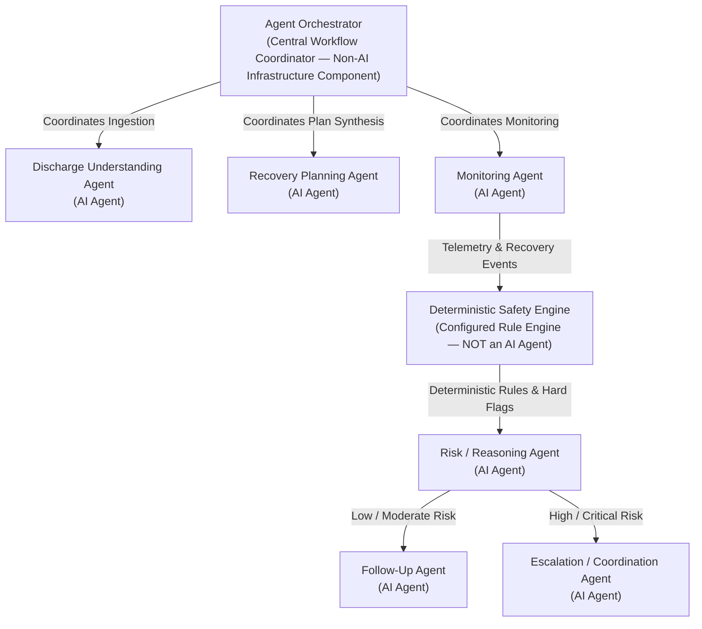

# CareBridge AI: System Architecture

## 1. Problem Statement: "Nobody Owns the Patient After Discharge"

The transition of care from the inpatient hospital setting to home recovery represents one of the most vulnerable and costly gaps in modern healthcare:

- **Clinical Information Overload:** Patients receive 10–25 pages of dense discharge summaries containing clinical jargon, complex medication titration schedules, wound management instructions, activity restrictions, and emergency red-flag warnings.
- **Cognitive Impairment at Transition:** At discharge, patients are frequently fatigued, recovering from anesthesia, medicated, or in emotional distress. Medical studies reveal that over 50% of patients fail to understand or recall essential discharge instructions within 24 hours.
- **The Outpatient "Care Void":** In conventional healthcare, clinical teams receive zero structured feedback between discharge and the first scheduled outpatient visit (often 14–30 days post-discharge). Minor complications (e.g., fluid overload, early surgical site infections, medication non-adherence) develop unmonitored until an avoidable emergency department visit or hospital readmission occurs.
- **Readmission Impact:** Hospital readmissions within 30 days cost healthcare systems billions annually under value-based care and Medicare Hospital Readmissions Reduction Program (HRRP) penalties.

---

## 2. Proposed Solution

**CareBridge AI** is an agentic AI care coordination platform designed to bridge the post-discharge care void. The platform operates on a closed-loop cybernetic feedback model:

$$\text{OBSERVE} \longrightarrow \text{REASON} \longrightarrow \text{PLAN} \longrightarrow \text{ACT} \longrightarrow \text{FOLLOW-UP} \longrightarrow \text{OBSERVE}$$

### Key Capabilities
1. **Intelligent Ingestion:** Ingests unstructured discharge summaries and produces a structured clinical profile (`DischargeProfile`).
2. **Personalized Recovery Roadmaps:** Translates medical directives into day-by-day milestone roadmaps and granular daily tasks (medication schedules, vitals checks, wound inspections).
3. **Continuous Adherence & Symptom Monitoring:** Tracks task completion, detects missed medication doses, and provides a conversational recovery companion for logging symptoms.
4. **Dual-Layer Clinical Risk Reasoning:** Evaluates patient data through a deterministic safety engine (hard medical rules) coupled with contextual LLM reasoning.
5. **Standardized Clinical Escalations:** Triages high-risk events to the healthcare team using standardized SBAR (Situation, Background, Assessment, Recommendation) clinical notes.
6. **Longitudinal Provider Hand-Off:** Generates comprehensive recovery trajectories for outpatient follow-up consultations.

---

## 3. User Roles & Access Boundaries

| Role | Interface | Primary Responsibilities | Access Level |
| :--- | :--- | :--- | :--- |
| **Patient** | Mobile PWA Patient Portal | View daily tasks, check off medications, record vitals, report symptoms, chat with Recovery Companion | Read/Write own recovery data; Read own clinical profile |
| **Family Caregiver (Proxy)** | Mobile PWA Patient Portal | Assist patient with task completion, monitor adherence, receive critical alert notifications | Read/Write assigned patient's tasks & vitals |
| **Care Coordinator / Triage Nurse** | Clinical Web Dashboard | Monitor risk-ranked triage board, review SBAR escalation tickets, conduct patient outreach, resolve tickets | Read/Write all patients within assigned clinic or department |
| **Attending Physician / Surgeon** | Clinical Web Dashboard | Review complex escalation summaries, modify treatment plans, review longitudinal recovery trends | Read/Write clinical orders, plans, and resolved escalations |
| **System Administrator / Auditor** | Admin Console | Monitor agent performance, audit reasoning traces, inspect deterministic safety rule logs | Full audit access; System configuration |

---

## 4. High-Level System Architecture

CareBridge AI follows a modern, decoupled, event-driven architecture organized into five discrete layers:



---

## 5. Architectural Subsystems

### 5.1 Presentation Layer
- **Patient Recovery Portal:** Responsive Progressive Web App (PWA) optimized for mobile smartphones and tablets. Focuses on low cognitive load, large typography, high contrast, and accessibility (WCAG 2.1 AA). Provides one-tap task completion, quick symptom logging, and a continuous conversational companion.
- **Healthcare Team Dashboard:** High-density desktop clinical portal. Implements real-time prioritization sorting patients by computed clinical risk score (`CRITICAL`, `HIGH`, `MODERATE`, `LOW`). Displays structured SBAR tickets, historical vitals trends, and an interactive agent audit drawer for clinical review.

### 5.2 API Gateway Layer
- Built with **FastAPI** (Python 3.11) utilizing **Pydantic v2** models for strict request/response data validation.
- Enforces Role-Based Access Control (RBAC) and JSON Web Token (JWT) session validation on all protected routes.
- Decouples client presentation from agent workflow execution via asynchronous task scheduling.

### 5.3 Agentic AI Core (Orchestrator)
- Implements a central **Supervisor Orchestration Engine** managing agent lifecycle, state transitions, and context propagation.
- Mediates all agent-to-agent communication via typed event contracts (`RecoveryEvent`, `AgentDecisionEvent`, `EscalationEvent`).
- Enforces determinism by channeling every event through the **Deterministic Safety Engine** prior to, or in parallel with, generative LLM reasoning.

### 5.4 LLM Inference Layer
- Powered by **Google Gemini 2.5 Flash** (for low-latency conversational queries and real-time monitoring) and **Gemini 1.5 Pro** (for deep clinical reasoning and initial discharge parsing).
- Standardized on structured JSON outputs (`response_mime_type="application/json"`) adhering to strict Pydantic schemas.

### 5.5 Persistence & Telemetry Layer
- **Relational Clinical Store:** PostgreSQL (production) / SQLite (development) maintaining patient accounts, structured discharge profiles, daily care tasks, vitals, and escalation tickets.
- **Immutable Audit Store:** Detailed append-only event log recording every observation, deterministic safety check, LLM prompt, raw reasoning trace, and dispatched action.

---

## 6. Healthcare Safety Limitations & Clinical Boundaries

CareBridge AI operates under non-negotiable healthcare safety guardrails designed to prevent patient harm, liability, and hallucinated medical guidance:

```
+-------------------------------------------------------------------------+
|                  NON-NEGOTIABLE CLINICAL BOUNDARIES                     |
+-------------------------------------------------------------------------+
| 1. NOT A DOCTOR: No medical diagnosis generation under any circumstance |
| 2. NO PRESCRIPTION: Never alter, increase, or cancel medication dosages |
| 3. STRICT GROUNDING: Restrict all advice to the ingested discharge plan |
| 4. HARD SAFETY OVERRIDE: Deterministic rules override LLM outputs       |
| 5. PERSISTENT DISCLAIMER: Visible emergency warnings on all UI surfaces |
+-------------------------------------------------------------------------+
```

### Specific Safety Constraints:
1. **Non-Diagnostic Constraint:** The system is explicitly forbidden from generating clinical diagnoses. If a patient presents with fever, warmth, and purulent drainage at an incision site, the system must not state: *"You have an infection."* Instead, it states: *"Your reported symptoms require urgent evaluation by your surgical care team."*
2. **Prescription Invariance:** The system must never instruct a patient to change medication dosage or timing. Queries regarding missed doses are answered strictly according to the discharge instructions or referred to the attending physician or dispensing pharmacist.
3. **Grounding in Ingested Orders:** The AI is bounded strictly by the ingested `DischargeProfile`. If asked questions outside this context (e.g., unrelated medical questions or unprescribed supplements), it responds with an explicit boundary notice.
4. **Emergency Failsafe:** All patient interfaces feature an un-dismissible emergency banner: *"CareBridge AI is an administrative recovery coordinator, not a doctor. If you are experiencing chest pain, severe shortness of breath, or a life-threatening emergency, call 911 immediately."*

---

## 7. Security, Privacy & HIPAA Compliance

1. **Zero Protected Health Information (PHI) in Development:** CareBridge AI uses 100% synthetic patient profiles during development, testing, and demonstration. No real patient data is ingested or stored.
2. **Encryption Standards:**
   - **In-Transit:** All client-to-backend and backend-to-LLM communications require TLS 1.3 encryption.
   - **At-Rest:** Database volumes, backup archives, and application logs are encrypted using AES-256.
3. **Role-Based Access Control (RBAC):** Strict separation of privileges ensures patients access only their own records, while clinicians access records within their assigned hospital unit.
4. **Auditability & Explainability:** Every automated agent decision stores the complete inputs, deterministic rule outputs, LLM prompt tokens, and timestamped reasoning trace in an append-only audit trail to support clinical accountability and regulatory compliance.
