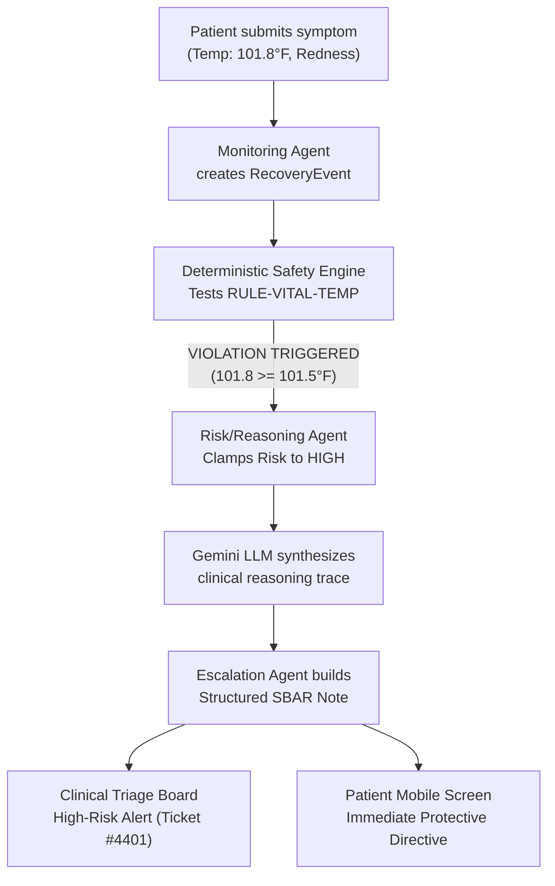
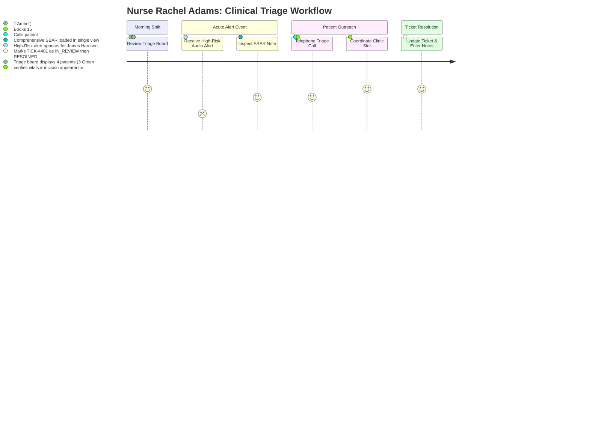

# CareBridge AI: Patient & Healthcare-Team Recovery Journey

## 1. Executive Summary & Clinical Personas

This document outlines the end-to-end user journeys for both the recovering patient and the hospital clinical care team. It illustrates how CareBridge AI operates autonomously across a 30-day post-discharge timeline to prevent avoidable complications and hospital readmissions.

### Primary Clinical Persona: James Harrison
- **Demographics:** 71-year-old male, retired civil engineer.
- **Procedure:** Coronary Artery Bypass Graft x3 (LIMA to LAD, SVG to OM1, SVG to RCA) on 2026-09-14.
- **Discharge Date:** 2026-09-16 (Post-Op Day 2).
- **Core Clinical Challenges:** Complex multi-drug regimen (Beta-blockers, dual antiplatelets, statins), sternal bone healing precautions, surgical wound vigilance, fluid and weight monitoring.
- **Assigned Surgical Attending:** Dr. Sarah Jenkins, MD, Cardiothoracic Surgery.
- **Primary Care Coordinator:** Rachel Adams, RN, Post-Surgical Triage Coordinator.

---

## 2. Chronological Patient Journey (Day 0 to Day 30)

```mermaid
timeline
    title James Harrison: 30-Day Recovery Journey
    section Day 0 : Hospital Discharge
        Hospital Paperwork Ingestion : Raw summary converted to DischargeProfile
        Plan Generation : 30-Day Roadmap & Daily Checklist initialized
        Mobile Onboarding : Large-print PWA setup with spouse
    section Days 1-2 : Routine Recovery
        Adherence Tracking : Morning meds & daily weight logged
        Companion Chat : Sternal sleeping position query answered
    section Day 3 : Acute Complication
        Symptom Logging : Incision redness & temp 101.8°F reported
        Deterministic Pre-Emption : RULE-VITAL-TEMP triggers High Risk
        Instant Escalation : SBAR Note dispatched; Care team alerted
    section Days 4-7 : Stabilization
        Nurse Outreach : Clinic visit & oral antibiotics started
        Plan Adaptation : Antibiotic tasks added to daily checklist
    section Days 8-30 : Rehabilitation
        PT Milestones : Light walking goals achieved
        Clinical Hand-Off : Longitudinal recovery summary delivered to Dr. Jenkins
```

---

### Phase 1: Day 0 — Hospital Discharge & Onboarding

#### 1. Ingestion & Plan Generation
1. Before hospital departure, the discharge nurse uploads James Harrison's 14-page discharge packet into the CareBridge backend via `/api/v1/discharge/ingest`.
2. The **Discharge Understanding Agent** analyzes the document and synthesizes a structured `DischargeProfile`:
   - 6 prescribed medications (with clock-time schedules).
   - Activity restrictions: Strict sternal precautions (no lifting $> 10\text{ lbs}$, hug heart pillow when coughing).
   - Core warning signs: Fever $> 101.5^\circ\text{F}$, wound drainage, chest pain, or sudden shortness of breath.
3. The **Recovery Planning Agent** automatically synthesizes a 30-day recovery plan decomposed into 4 distinct phases, populating Day 1 through Day 30 daily tasks.

#### 2. Patient Mobile Experience
- James's spouse, Martha, opens the CareBridge mobile PWA link sent via SMS.
- The interface loads with high-contrast, large text and an uncluttered dashboard showing:
  - Today's date and "Recovery Day 0".
  - Emergency 911 banner at top.
  - Three scheduled morning tasks for tomorrow.

---

### Phase 2: Days 1–2 — Routine Recovery & Adherence

#### 1. Morning Check-in (Day 1, 08:00)
- The portal chimes a gentle reminder for morning tasks.
- James taps to confirm taking:
  - Metoprolol Succinate 50mg (BP & Heart Rate control).
  - Aspirin 81mg (Antiplatelet graft patency).
- James records his baseline vitals:
  - Blood Pressure: `128/78 mmHg`
  - Heart Rate: `72 bpm`
  - Morning Weight: `182.4 lbs`
- The **Monitoring Agent** ingests the data, marks tasks as `COMPLETED`, and calculates 100% adherence.

#### 2. Conversational Recovery Companion Interaction (Day 2, 21:00)
- James types a message into the Recovery Companion:
  > *"My lower back is really aching. Can I sleep on my right side tonight?"*
- The **Follow-Up Agent** processes the query, cross-references his `DischargeProfile` (Sternal Precautions), and replies:
  > *"Mr. Harrison, your discharge instructions state to sleep flat on your back for the first several weeks to allow your sternum (breastbone) to fuse properly. Sleeping on your side puts uneven stress on the chest bone. Try placing a supportive pillow beneath your knees to relieve back pressure. If the back pain persists, let us know."*

---

### Phase 3: Day 3 — Acute Complication & Autonomous Escalation

#### 1. Midday Incision Check & Symptom Reporting (Day 3, 13:10)
- While checking his chest incision in the mirror, James notices the lower edge is red and feels warm to the touch. He feels slightly chilled and uses a digital thermometer: `101.8°F`.
- James opens the CareBridge **Symptom Reporting Wizard**:
  - Selects symptom: *Redness and warmth at incision*.
  - Inputs temperature: `101.8°F`.
  - Severity rating: `7 / 10`.

#### 2. Behind-the-Scenes Agentic Execution Trace


1. **Deterministic Pre-Emption:** The **Deterministic Safety Engine** intercepts the input. Core temperature $101.8^\circ\text{F} \ge 101.5^\circ\text{F}$ threshold, triggering `RULE-VITAL-TEMP`. The risk tier is forcibly clamped to **`HIGH`**, preventing any potential LLM hallucination of safety.
2. **Contextual Reasoning:** The **Risk/Reasoning Agent** reviews the full patient history: Post-Op Day 3 CABG + fever + localized sternal erythema = high likelihood of early surgical site infection.
3. **SBAR Note Synthesis:** The **Escalation / Coordination Agent** invokes Gemini to generate a structured SBAR clinical note.
4. **Immediate Patient Directive:** James's screen immediately presents a clear instruction:
   > *"We have notified your surgical care team regarding your fever (101.8°F) and incision warmth. A nurse coordinator will contact you shortly. Please keep the incision area clean and dry—do not apply any lotions, creams, or tight bandages. If you experience severe chest pain or shortness of breath, call 911 immediately."*

---

### Phase 4: Days 4–7 — Clinical Intervention & Re-stabilization

1. Nurse Coordinator Rachel Adams contacts James within 15 minutes of the alert, conducts a telephone triage, and schedules him for an evaluation at the outpatient surgical clinic at 15:30.
2. Dr. Jenkins examines the incision, takes a wound culture, and initiates a 10-day course of Cephalexin 500mg QID for localized superficial cellulitis.
3. Rachel updates the clinical dashboard: ticket `TICK-4401` is marked `RESOLVED`.
4. The **Recovery Planning Agent** dynamically updates James's daily checklist to incorporate four daily Cephalexin dosage reminders.
5. By Day 6, James's temperature normalizes to `98.6°F` and erythema recedes.

---

### Phase 5: Days 8–30 — Rehabilitation & Clinical Hand-Off

1. **Mobility Milestones:** James successfully hits his Phase 3 milestone: walking 15 minutes twice daily with zero dizziness or dyspnea.
2. **Day 14 Follow-Up Prep:** Ahead of his outpatient visit with Dr. Jenkins, the system automatically compiles a **Longitudinal Recovery Summary**:
   - 30-day medication adherence score: `96.4%`.
   - Vitals trend graphs (stable blood pressure averaging `124/76 mmHg`, stable weight).
   - Complete resolution of the Day 3 wound event.
3. Dr. Jenkins reviews the 1-page structured summary during the 15-minute consultation, confirming successful recovery with zero hospital readmissions.

---

## 3. Healthcare-Team Journey (Clinical Workflow)



### Step-by-Step Clinical Experience:

#### 1. Morning Triage Monitoring
- Nurse Coordinator Rachel Adams opens the CareBridge **Clinical Triage Board**.
- The board automatically sorts patients by clinical priority:
  - 🔴 **CRITICAL:** Immediate life-safety concern (None currently).
  - 🟠 **HIGH:** Urgent red-flag warning or rule violation (1 patient: James Harrison).
  - 🟡 **MODERATE:** Missed non-critical task or mild reported symptom (2 patients).
  - 🟢 **LOW:** Fully adherent, vitals within target baseline (1 patient).

#### 2. Investigating High-Risk Alert
- Clicking James Harrison's profile opens the **SBAR Escalation Viewer**:
  - **Situation:** *Patient James Harrison (POD 3 CABG) reports fever of 101.8°F with localized sternal incision warmth and redness.*
  - **Background:** *71yo male post-CABG x3 on 2026-09-14. On dual antiplatelets and Metoprolol. No prior sternal instability.*
  - **Assessment:** *Deterministic violation `RULE-VITAL-TEMP` (101.8°F $\ge$ 101.5°F). Early surgical site infection suspected.*
  - **Recommendation:** *Immediate telephone triage. Inspect for purulent discharge; arrange same-day wound clinic evaluation.*

#### 3. Resolving the Escalation
- Rachel clicks **"Assign to Me"** $\longrightarrow$ ticket moves to `IN_REVIEW`.
- Rachel calls James via the integrated contact number, confirms symptoms, and schedules a clinic check at 15:30.
- Rachel enters clinical documentation directly into the dashboard note field:
  > *"Telephoned patient. Confirmed oral temp 101.8°F. Sternal edge erythematous 2cm margin, no fluctuance or gross drainage. Scheduled for surgical clinic review today at 15:30."*
- Ticket status is updated to `RESOLVED`, archiving the event with a full cryptographic audit trail.

---

## 4. End-to-End Concrete Data Payload Walkthrough

### 1. Ingested Symptom Submission (`POST /api/v1/symptoms/report`)
```json
{
  "patient_id": "PT-CABG-001",
  "symptom_description": "My chest incision feels unusually hot and looks red, temp is 101.8 F.",
  "severity_score": 7,
  "measured_temp": 101.8,
  "anatomical_location": "Chest Incision",
  "reported_at": "2026-09-18T13:10:00Z"
}
```

### 2. Emitted Observation Telemetry (`RecoveryEvent`)
```json
{
  "event_id": "EVT-88219-TEMP",
  "patient_id": "PT-CABG-001",
  "event_type": "SYMPTOM_AND_VITAL_SUBMISSION",
  "observation_payload": {
    "temp_fahrenheit": 101.8,
    "symptom": "Incision warmth and erythema",
    "severity": 7,
    "post_op_day": 3
  },
  "timestamp": "2026-09-18T13:10:05Z",
  "source_agent": "MONITORING_AGENT"
}
```

### 3. Safety Pre-Emption & Risk Assessment (`RiskAssessment`)
```json
{
  "assessment_id": "RA-99102",
  "patient_id": "PT-CABG-001",
  "risk_level": "HIGH",
  "deterministic_override": true,
  "flagged_rules": [
    "RULE-VITAL-TEMP: Core body temperature 101.8°F exceeds threshold 101.5°F"
  ],
  "clinical_reasoning": "Patient is on Post-Operative Day 3 following median sternotomy for 3-vessel CABG. The combination of core fever (101.8°F) and localized surgical site erythema/warmth satisfies high-risk red-flag criteria for early surgical site infection. Mandates same-day clinical review.",
  "recommended_route": "ESCALATION_COORDINATION_AGENT"
}
```

### 4. Generated Escalation Ticket & SBAR (`EscalationTicket`)
```json
{
  "ticket_id": "TICK-4401",
  "patient_id": "PT-CABG-001",
  "risk_level": "HIGH",
  "status": "OPEN",
  "triggered_rule": "RULE-VITAL-TEMP",
  "sbar_note": {
    "situation": "Patient James Harrison (Post-Op Day 3 CABG) reports core body temperature of 101.8°F accompanied by localized warmth and erythema at the sternotomy site.",
    "background": "71yo male post-CABG x3 on 2026-09-14. Discharge medications include Metoprolol 50mg, Aspirin 81mg, Plavix 75mg. Baseline vitals stable prior to this event.",
    "assessment": "Deterministic safety rule violation (RULE-VITAL-TEMP). Symptom complex suggests probable early surgical site infection (SSI) versus superficial cellulitis.",
    "recommendation": "Prompt nurse telephone triage to evaluate for drainage or sternal instability; coordinate same-day outpatient wound evaluation."
  },
  "created_at": "2026-09-18T13:10:12Z"
}
```
